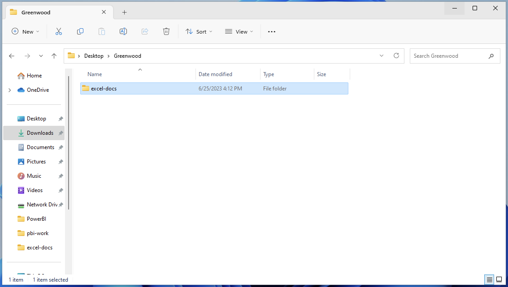
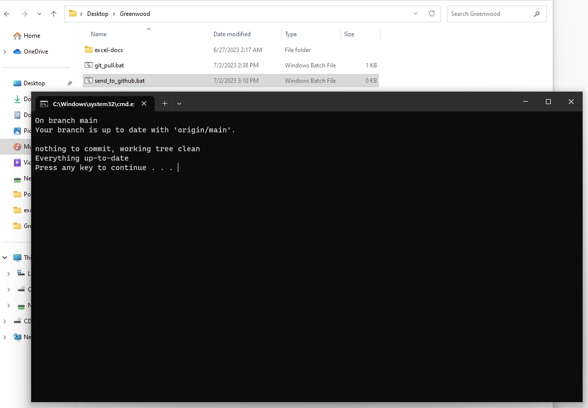
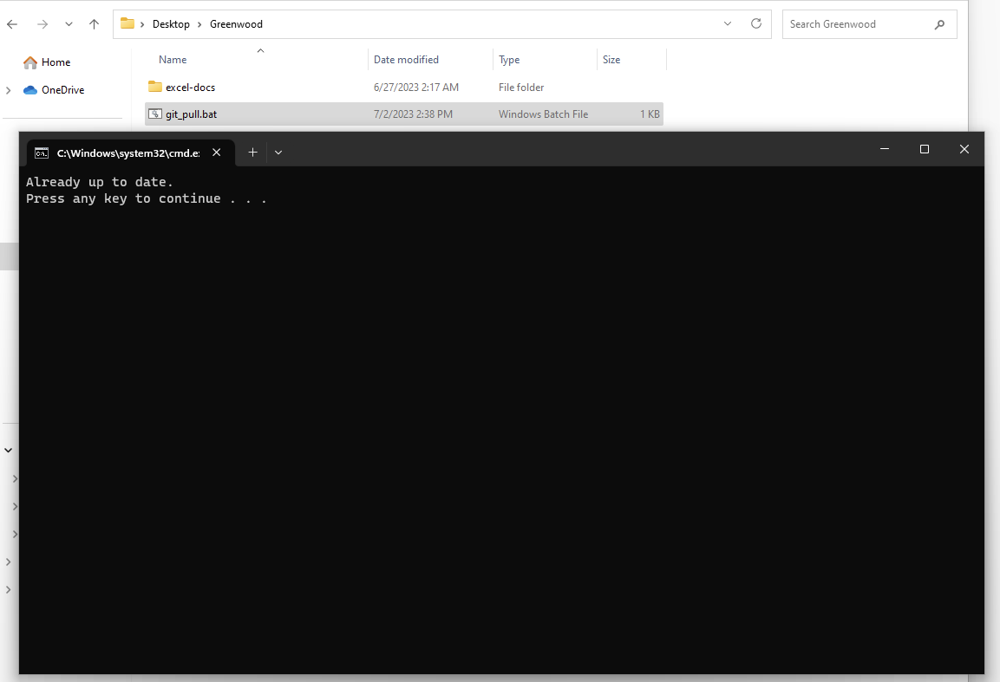

# Github Workflow
# Installing the Latest Git Client and GitExtensions

## Introduction:
This guide will provide you with detailed instructions on how to install the latest version of the Git client. Additionally, it will cover the steps required to configure your Git profile on your computer. Git is a popular version control system that enables you to manage and track changes to your codebase efficiently.

Note: These instructions assume you are using a Windows operating system.

### Step 1: Downloading and Installing Git Client
1. Open your preferred web browser and navigate to the official Git website: https://git-scm.com/downloads
2. On the Downloads page, click on the link corresponding to your operating system to initiate the download.
3. Once the download is complete, locate the installer file and double-click on it to begin the installation.
4. In the installation wizard, follow the on-screen prompts to proceed with the installation.
5. During the installation, you can choose the components you wish to install. Ensure that "Git Bash Here," "Git GUI Here," and "Associate .git* configuration files with the default text editor" are selected.
6. On the "Adjusting your PATH environment" screen, select "Use Git from the Windows Command Prompt."
7. Continue with the installation by clicking "Next" and then "Install."
8. Once the installation is complete, click "Finish" to exit the installer.

### Step 2: Configuring Git Profile
1. Open the Git Bash terminal by right-clicking in any folder and selecting "Git Bash Here."
2. In the terminal, type the following command and press Enter:
   ```
   git config --global user.name "Your Name"
   ```
   Replace "Your Name" with your actual name (e.g., John Doe). This command sets the global Git username.
3. Next, type the following command and press Enter:
   ```
   git config --global user.email "your.email@example.com"
   ```
   Replace "your.email@example.com" with your actual email address. This command sets the global Git email.
4. To verify that your Git profile is configured correctly, type the following command and press Enter:
   ```
   git config --global user.name
   ```
   The terminal should display the name you provided in Step 2.2.

5. Similarly, type the following command and press Enter to verify your email configuration:
   ```
   git config --global user.email
   ```
   The terminal should display the email address you provided in Step 2.3.
6. Your Git profile is now configured on your computer.

### Step 3: Cloning the document repository

#### Step 3.1: Open the Git Bash terminal
1. Click on the Windows Start button.
2. Type "Git Bash" in the search bar.
3. Click on the "Git Bash" application to open the terminal.

#### Step 3.2: Navigate to the directory where you want to clone the repository
1. Use the "cd" command to navigate to the directory where you want to clone the repository. For example, if you want to clone the repository in the "Documents" folder, type the following command and press Enter:
```
cd Documents
```
2. Alternatively, you can navigate to the directory by using the Windows File Explorer and then right-clicking on the directory and selecting "Git Bash Here".

#### Step 3.3: Clone the repository
1. In the Git Bash terminal, type the following command and press Enter:
```
git clone https://github.com/Green-Wood-Cemetery/excel-docs.git
```
2. This will initiate the cloning process and create a local copy of the repository in the current directory.

#### Step 3.4: Verify the repository is cloned successfully
1. After the cloning process is completed, navigate to the cloned repository's directory using the "cd" command.
```
cd excel-docs
```
2. Type the following command and press Enter to see the repository's contents:
```
dir
```
3. This will display the list of files and directories in the repository.

### Step 4: Create the auxiliary scripts

This auxiliary scripts will help you to automate the process of keeping you repository updated and also to send your changes to GitHub.

#### Script 1: Pull Changes

This script should be used when you want to ensure that you folder is up to date.

1. Navigate to your working folder, as in the image:

2. Right-click to create a file
3. Name it git_pull.bat
4. Open it with Notepad
5. Paste the content below
```cmd
  @echo off
  cd excel-docs
  git pull
  pause
```
6. Save and close

#### Script 2: Send Changes To Github

This script should be used when you want to send your changes to Github and then to Elastic Search.

1. Navigate to your working folder, as in the image:

2. Right-click to create a file
3. Name it send_to_github.bat
4. Open it with Notepad
5. Paste the content below
```cmd
  @echo off
  cd excel-docs
  git add .
  git commit -m "Sending changes to github"
  git push
  pause
```
6. Save and close


### Step 5: How to use in your daily activities

#### Preparing to make changes on the files
1. Before start with the changes, go to Windows Explorer and navigate to the folder previous to the excel-docs folder

2. Double-click on the send_to_github.bat file
3. It is done!


 
#### Sending changes
1. Go to the folder excel-docs and make the changes on Excel files.
2. After finished with the changes, go to Windows Explorer and navigate to the folder previous to the excel-docs folder

3. Double-click on the git_pull.bat file
4. It is done!

